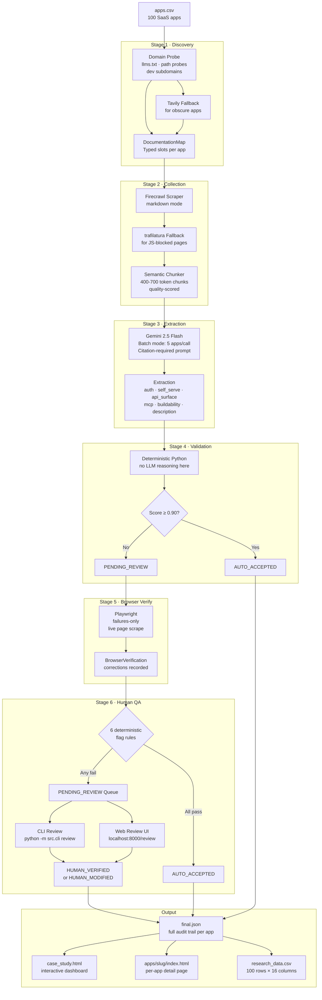
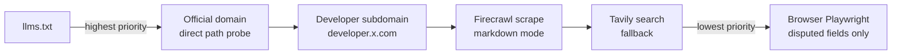
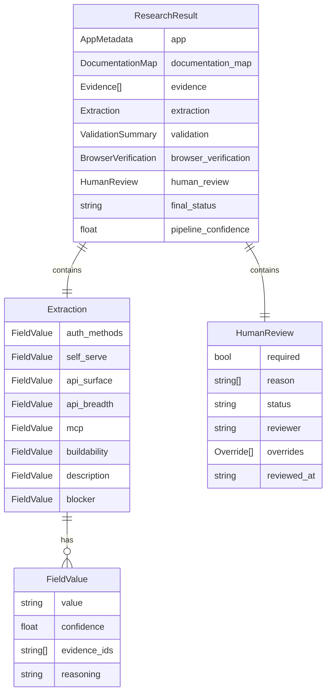

# Composio App Research Pipeline

> Evidence-driven AI pipeline that researches 100 SaaS applications and produces a verified, human-reviewed dataset for Composio toolkit integration analysis.

**96/100** apps fully extracted & validated · **73%** HIGH buildability · **27** apps with Official MCP support · Full audit trail on every field

---

## Architecture



### Evidence Priority Chain



### Data Model



---

## Quick Start

### Prerequisites

- Python 3.10+
- [uv](https://docs.astral.sh/uv/) package manager (`pip install uv`)
- API keys: Gemini, Tavily, Firecrawl (see `.env` setup below)

### 1. Clone & Install

```bash
git clone <repo-url>
cd composeio_assignment/backend

# Install dependencies (uv reads pyproject.toml automatically)
uv sync

# Install Playwright browsers for browser verification
uv run playwright install chromium
```

### 2. Configure API Keys

```bash
# Create backend/.env from template
cp .env.example .env   # or create manually

# Required keys in backend/.env:
GEMINI_API_KEY=your_key_here
TAVILY_API_KEY=your_key_here
FIRECRAWL_API_KEY=your_key_here
```

> **Note:** The repo already contains cached results for all 100 apps in `output/apps/`. You can skip the pipeline entirely and jump straight to viewing the report.

### 3. View Existing Results (no API keys needed)

```bash
# Generate the HTML report from cached final.json files
uv run python -m src.cli run --report-only

# Open the report
open output/case_study.html       # macOS
xdg-open output/case_study.html   # Linux
```

---

## Running the Pipeline

### Process all 100 apps

```bash
# Batch mode — 5 apps per LLM call (recommended, faster)
uv run python -m src.cli run --max 100 --batch

# Sequential mode — one app at a time (safer for debugging)
uv run python -m src.cli run --max 100
```

The pipeline is **fully resumable** — already-processed apps are skipped via `final.json` cache. Stop and restart at any point.

### Common options

| Flag | Effect |
|------|--------|
| `--max 10` | Process only the first N apps |
| `--batch` | 5 apps per LLM call (8× faster) |
| `--skip-browser` | Skip Playwright verification stage |
| `--report-only` | Regenerate HTML from cached JSONs only |
| `--force` | Reprocess even cached apps |

### Test a single app

```bash
uv run python -m src.cli test "GitHub"
uv run python -m src.cli test "Stripe"
```

---

## Human QA System

The pipeline automatically flags apps for review based on **6 deterministic rules**:

| Rule | Trigger |
|------|---------|
| Low validation score | `validation.score < 0.90` |
| Unknown access model | `self_serve == "UNKNOWN"` |
| Missing auth methods | `auth_methods` is UNKNOWN/empty |
| Low buildability | `buildability == "LOW"` |
| Browser discrepancies | `browser_verification.corrections` non-empty |
| Insufficient evidence | `evidence count < 3` |

### CLI Review

```bash
# Review all flagged apps interactively
uv run python -m src.cli review

# Review as a named reviewer
uv run python -m src.cli review --reviewer "Arpit"

# Review a specific app (bypass queue)
uv run python -m src.cli review --app "HubSpot"
```

The CLI shows each field with its pipeline value, evidence excerpt, and a prompt to confirm or override.

### Web Review UI

```bash
cd backend
python review_server.py
```

Opens at **http://localhost:8000**

| URL | Description |
|-----|-------------|
| `/` | Redirects to the main report |
| `/review` | QA dashboard — all flagged apps |
| `/review/{slug}` | Per-app review — field by field with evidence |
| `/apps/{slug}/` | Static app detail page |

From any per-app detail page, click **Review in QA →** in the nav bar to jump directly to its review page.

### Audit Trail

Every human override is recorded with full provenance:

```json
{
  "human_review": {
    "status": "completed",
    "reviewer": "Arpit",
    "reviewed_at": "2026-07-14T08:00:00Z",
    "overrides": {
      "auth_methods": {
        "old": "UNKNOWN",
        "new": "OAuth 2.0",
        "reason": "Confirmed on developer.example.com/auth page"
      }
    }
  },
  "final_status": "HUMAN_MODIFIED"
}
```

---

## Project Structure

```
composeio_assignment/
├── README.md
├── frontend/
│   └── index.html          # Standalone demo page (Vercel entry point)
└── backend/
    ├── data/
    │   ├── apps.csv         # 100 SaaS applications to analyze
    │   └── cache/           # Discovery cache (avoids re-fetching URLs)
    ├── models/              # Pydantic data models
    │   ├── app.py           # AppMetadata (name, website, slug, category_hint)
    │   ├── discovery.py     # DocumentationMap, DocumentSlot
    │   ├── evidence.py      # Evidence (url, title, snippet, slot_name)
    │   ├── extraction.py    # Extraction, FieldValue (value + confidence + evidence_ids)
    │   ├── validation.py    # ValidationSummary (score, status, fields)
    │   └── result.py        # ResearchResult, HumanReview (full audit trail)
    ├── src/
    │   ├── cli.py           # Typer CLI: run · test · review
    │   ├── config.py        # All path constants + Settings (env vars)
    │   └── pipeline/
    │       ├── orchestrator.py    # Pipeline controller, batching, caching
    │       ├── discovery.py       # Stage 1: URL discovery + DocumentationMap
    │       ├── collector.py       # Stage 2: Firecrawl + fallback scraping
    │       ├── extraction.py      # Stage 3: Gemini LLM extraction
    │       ├── validator.py       # Stage 4: Deterministic validation checks
    │       ├── browser_verify.py  # Stage 5: Playwright verification
    │       ├── analytics.py       # Pandas + Plotly analytics for report
    │       └── report.py          # Jinja2 HTML report generator
    ├── templates/
    │   ├── report.html       # Main dashboard template
    │   └── app_detail.html   # Per-app detail template
    ├── prompts/
    │   └── extraction.md     # LLM extraction prompt (citation-required)
    ├── output/               # Generated results (committed to git)
    │   ├── case_study.html   # Main interactive report
    │   ├── research_data.csv # Full data export (100 rows × 16 columns)
    │   └── apps/{slug}/
    │       ├── final.json    # Full result with audit trail
    │       └── index.html    # App detail page
    ├── review_server.py      # FastAPI human QA web server
    ├── pyproject.toml        # Dependencies
    └── uv.lock               # Locked dependency tree
```

---

## Deployment on Vercel

The static output is deployable as a **static site** — no server needed for the report.

### Option A — Deploy the static report (recommended)

The `output/` directory contains 100% static HTML. No build step required.

1. **Create `vercel.json`** at the repo root:

```json
{
  "rewrites": [
    { "source": "/", "destination": "/backend/output/case_study.html" },
    { "source": "/apps/:slug", "destination": "/backend/output/apps/:slug/index.html" }
  ]
}
```

2. **Push to GitHub** and connect your repo to [vercel.com](https://vercel.com).

3. In Vercel dashboard:
   - **Framework Preset:** `Other`
   - **Root Directory:** `.` (repo root)
   - **Build Command:** *(leave empty)*
   - **Output Directory:** `backend/output`

4. Deploy — done. Your report is live at `https://<your-project>.vercel.app`.

### Option B — Deploy via Vercel CLI

```bash
npm i -g vercel
vercel --cwd . --yes
```

> **Note:** The Human QA review server (`review_server.py`) is a local tool only — it runs locally and writes to `final.json` files. It is NOT deployed to Vercel.

---

## Key Design Principles

| Principle | Implementation |
|-----------|---------------|
| **No hallucination** | Pipeline returns `UNKNOWN` when evidence is absent — never guesses |
| **Evidence provenance** | Every extracted value cites `evidence_id[]` traceable to source URLs |
| **Deterministic validation** | Validation stage is pure Python — no LLM reasoning |
| **Immutable pipeline** | Human review records overrides separately; raw pipeline values preserved |
| **Full audit trail** | Every override records: field, old value, new value, reason, reviewer, timestamp |
| **Resumability** | Each app's result cached in `final.json`; pipeline restartable at any point |

---

## Dataset Overview (100 apps)

| Metric | Value |
|--------|-------|
| Total apps | 100 |
| Fully extracted & validated | 96 |
| Pipeline FAILED | 1 (Binance — CloudFlare blocked) |
| HIGH buildability | 73% |
| Official MCP support | 27 |
| High confidence (≥75%) | 58 |
| Auth UNKNOWN | 36% (no evidence found, not guessed) |

---

## Why auth_methods is UNKNOWN for 36% of apps

This is intentional. The pipeline does not guess auth methods from vague marketing copy. If the authentication docs are:
- behind a JavaScript wall that Firecrawl's markdown mode can't penetrate,
- in deeply nested sub-pages not reached during discovery, or
- simply undocumented on the public web,

then the value is `UNKNOWN`. Browser verification (Playwright) catches auth keywords from live pages and records them in `browser_verification.corrections`, but the core `auth_methods.value` field is not mutated post-extraction (pipeline immutability). The correction is visible on each app's detail page.
